# 🏠 Member Capabilities - Visual Guide

## 🎯 Member Role Overview

Members are residents of a society who have been approved by the SUB_ADMIN (Chairman). They have comprehensive access to society services while maintaining appropriate security boundaries.

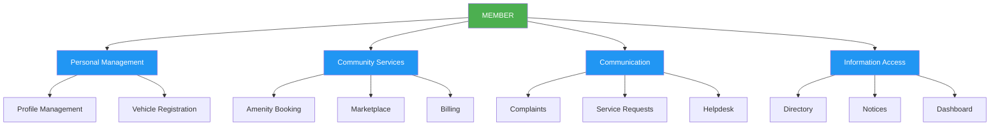

## ✅ FULL ACCESS Capabilities

### 🚗 Vehicle Management
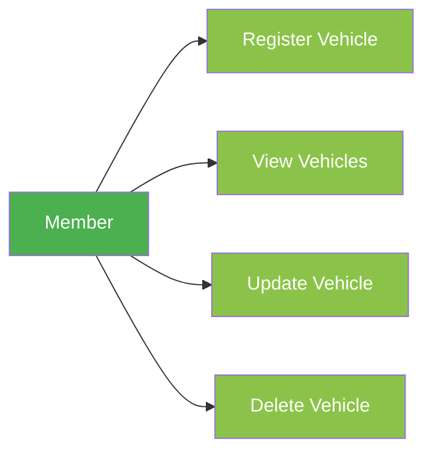

### 🏖️ Amenity Booking
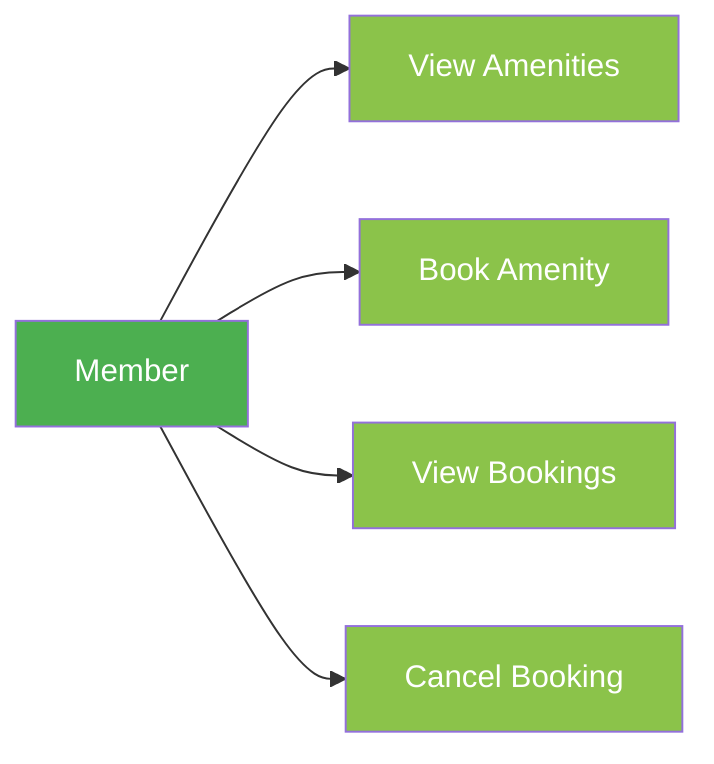

### 📉 Complaint Management
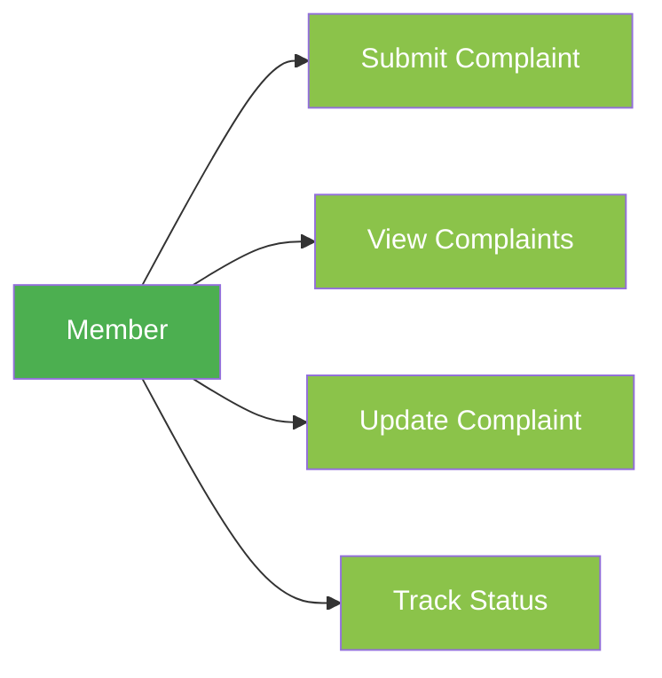

### 🛒 Marketplace
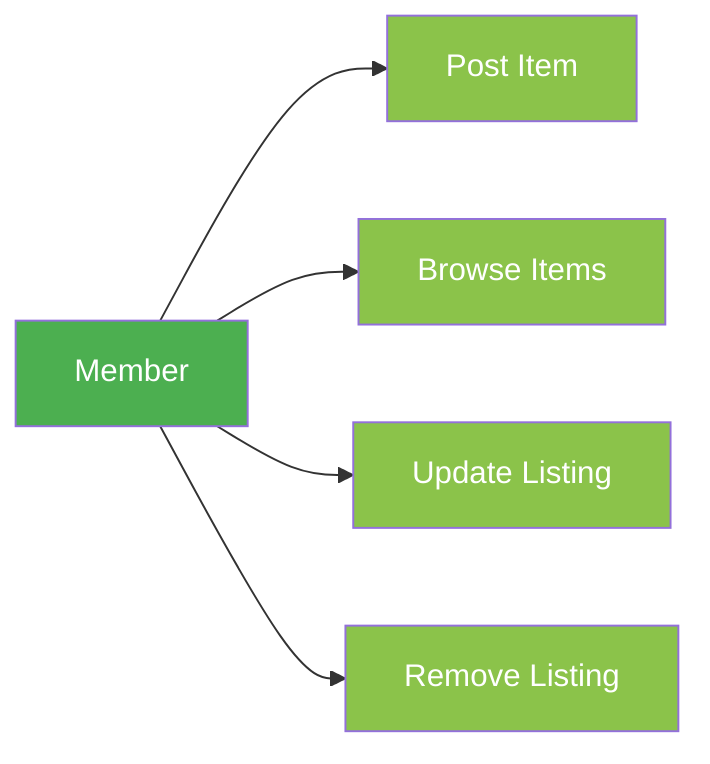

## 👁️ READ-ONLY Access

### 📚 Directory Access
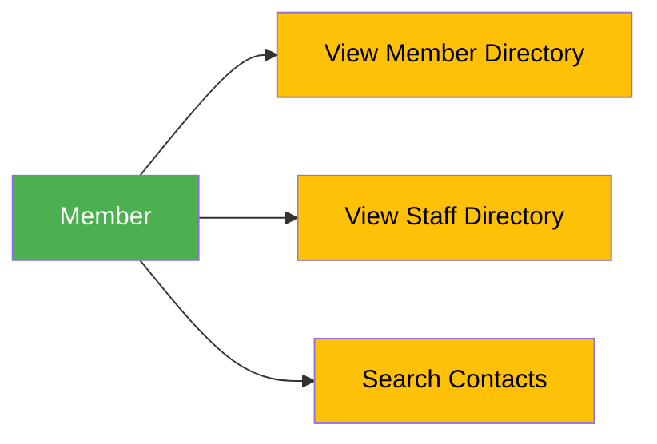

### 📰 Notices & Announcements
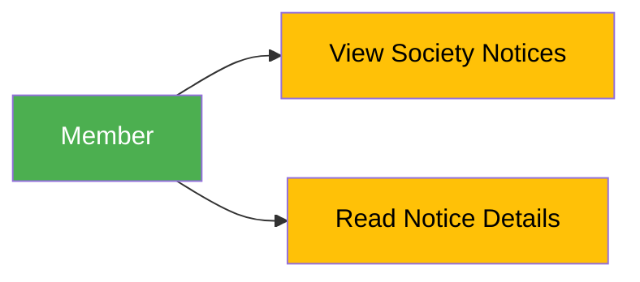

### 💰 Billing Information
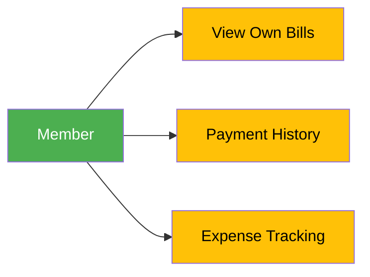

## 🚫 RESTRICTED Functions (Security)

### 👨‍💼 Staff Management
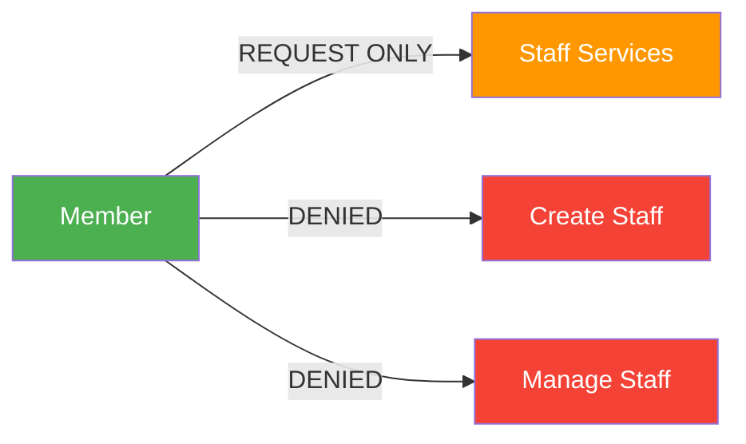

### 🎫 Visitor Management
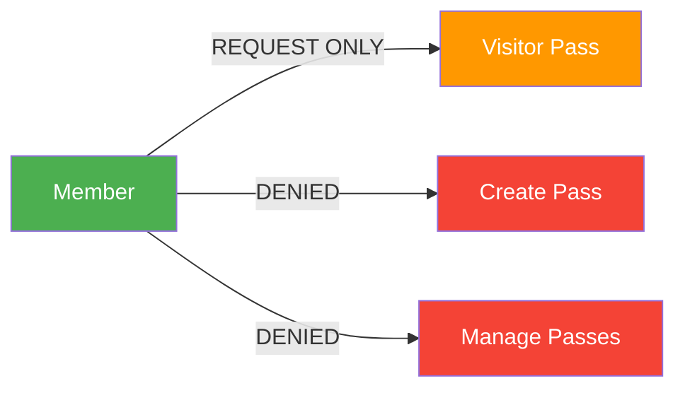

### 🚪 Gate Management
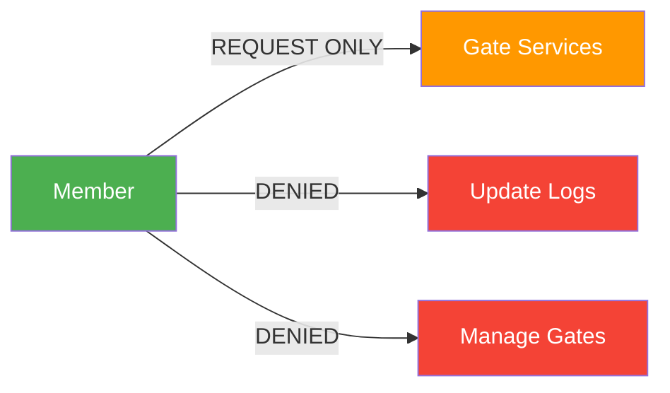

## 🔐 Security Boundaries

### Role-Based Access Control
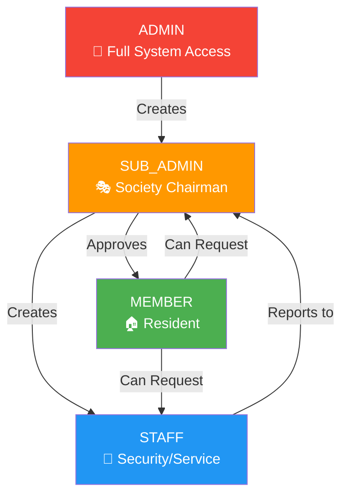

## 📊 Member Dashboard Overview

Members have access to a personalized dashboard showing:

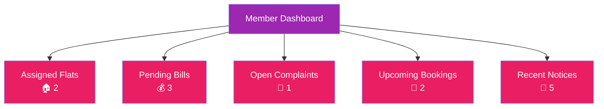

## 🔄 Request Workflow for Restricted Services

## 📋 Summary Table

| Capability | Access Level | Through API | Notes |
|------------|--------------|-------------|-------|
| **Profile Management** | ✅ FULL | `PATCH /auth/profile/` | Update personal info |
| **Vehicle Registration** | ✅ FULL | `POST /vehicles/` | Add/Manage vehicles |
| **Amenity Booking** | ✅ FULL | `POST /amenity-bookings/` | Book society amenities |
| **Complaint Submission** | ✅ FULL | `POST /complaints/` | Report issues |
| **Marketplace Listing** | ✅ FULL | `POST /marketplace/` | Buy/Sell items |
| **Directory Access** | 👁️ READ-ONLY | `GET /directory/` | View contacts |
| **Notices Access** | 👁️ READ-ONLY | `GET /notices/` | View announcements |
| **Billing Info** | 👁️ READ-ONLY | `GET /maintenance-bills/` | View own bills |
| **Staff Creation** | 🚫 DENIED | N/A | Restricted to SUB_ADMIN |
| **Visitor Passes** | 🚫 DENIED | N/A | Restricted to SUB_ADMIN |
| **Gate Management** | 🚫 DENIED | N/A | Restricted to STAFF |

## 🎯 Key Benefits for Members

1. **✅ Comprehensive Access**: Full control over personal services
2. **✅ Community Participation**: Active role in society activities
3. **✅ Transparent Communication**: Clear channels for requests and issues
4. **✅ Security Assured**: Proper access controls for sensitive operations
5. **✅ Self-Service**: Most needs can be addressed independently

## 🔒 Security Benefits

1. **🔐 Role Isolation**: Members can only access their society's data
2. **🔐 Action Logging**: All member actions are recorded for audit
3. **🔐 Request Workflow**: Restricted functions follow approval process
4. **🔐 Data Privacy**: Member information protected from unauthorized access

This visual guide demonstrates that members have extensive capabilities in the Society Management System while maintaining appropriate security boundaries for sensitive operations.